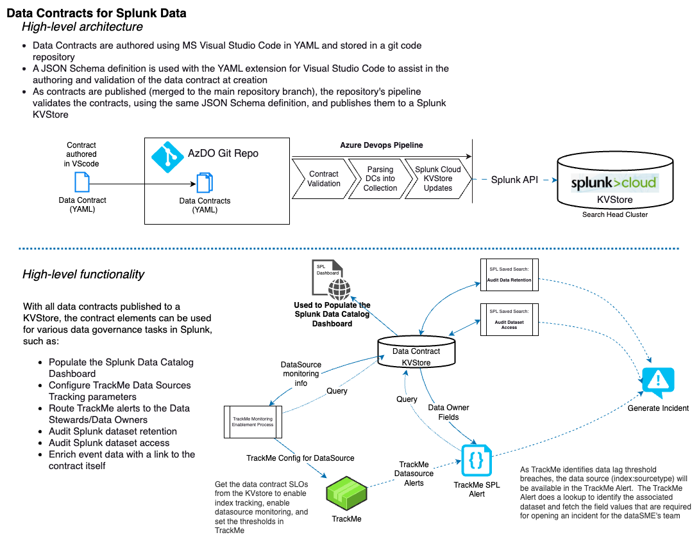

# Log Data Contracts

## Introduction 
The `log-data-contracts` repository provides templates and schemas for authoring YAML-formatted data contracts relevant to Splunk datasets.

## What is a Data Contract?
A data contract is a formal agreement between a service provider and a customer, detailing a data product to be exchanged. In the context of Splunk data ingestion, the exchange occurs between the "data owner" (the team or individual responsible for the originating system of Splunk events) and the Splunk Data Team (acting as data custodians). The data contract outlines the dataset description, ownership information, and the data handling requirements within Splunk.

## Why Use a Repository and YAML?
Traditional document formats like Word documents, Excel sheets, Markdown, or SharePoint often lead to forgotten contracts. These formats lack structure and standardization, making them unsuitable for automated processes. By using YAML with a defined schema, contracts become structured, enabling automation and interactive querying with tools like `yq`. Treating contracts as code allows them to be versioned, validated, reviewed, and integrated into automated pipelines.

## Data Contract Contents

### What Belongs in a Data Contract?
A data contract should capture:

- A description of the data being exchanged
- The mechanism of data exchange (e.g., Splunk ingestion pattern)
- Identities of business domains and teams responsible for data stewardship
- Data handling policies, including:
  - Searchability and retention durations
  - Accessibility restrictions

The data contract schema definition file specifies allowed or required elements. Consider if an a data element's presence in the contracts would change infrequently and could automate downstream processes; if so, it may be desirable and suitable for inclusion.

### What Does Not Belong in a Data Contract?
Data contracts should be concise, containing only essential metadata for data exchange, handling, and consumption. Avoid including frequently changing information, as updates require review and acceptance. Contracts are not meant to detail the data exchange process but should provide high-level descriptions and summaries. Avoid elements that would cause the data contract itself to create additional data debt.

### Guidance on Data Elements within Data Contracts

- **Data Contract as the Sole Source of Truth**:  
  Ensure the data contract is the sole source of truth or links to external sources. Avoid duplicating data available elsewhere, as this can lead to data debt.

- **Avoid Duplication of Data Elements**:  
  Exclude elements available from other systems. Consider integrating external data through dashboards or automation instead.

- **Distinct Identification of Dataset and Ownership**:
  - **Initial Subject Matter Expert (SME) Identification**:  
    Use `dataProductInitialSmeName` to record the initial SME, providing context for the dataset's origins.
  - **Owning Team Email Alias**:  
    Include a stable email alias for the dataset's owning team.
  - **Splunk Metadata Fields**:  
    Use Splunk fields to uniquely identify and monitor data quality, linking data contracts with Splunk events. Keep fields concise.

### Use cases and diagram for Data Contracts in Splunk
Refer to the .drawio diagram

### Schema Definition
Refer to the schema documentation in [Data Contract Schema](./docs/schema.md).

### Repository Structure
For details, see [Repository Details](./docs/repository_details.md).

### How a user would author a new data contract and add it to an active repository
See the [Data Contract Contribution Guide](./docs/contribution_guide.md).

### Contributing to This Data Contract Sample Repository
See the [Template Repository Contribution Guide](./CONTRIBUTING.md).

## Related Reading
- [PayPal Data Contract Template](https://github.com/paypal/data-contract-template)
- [The Next Generation of Data Platforms is the Data Mesh](https://medium.com/paypal-tech/the-next-generation-of-data-platforms-is-the-data-mesh-b7df4b825522) - PayPal Blog
- [Data Contracts - Everything You Need to Know](https://www.montecarlodata.com/blog-data-contracts-explained/)
